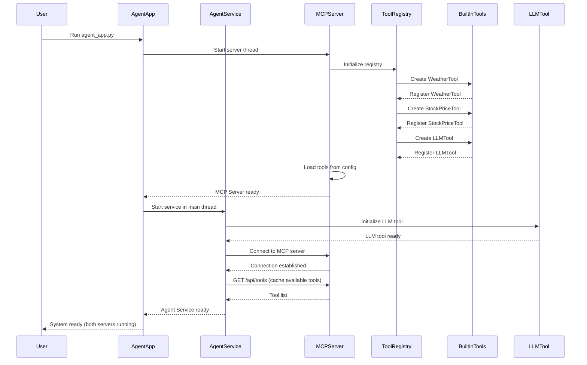

```mermaid
sequenceDiagram
    participant User
    participant AgentApp
    participant AgentService
    participant MCPServer
    participant ToolRegistry
    participant BuiltInTools
    participant LLMTool

    User->>AgentApp: Run agent_app.py
    
    %% MCP Server Initialization
    AgentApp->>MCPServer: Start server thread
    MCPServer->>ToolRegistry: Initialize registry
    ToolRegistry->>BuiltInTools: Create WeatherTool
    BuiltInTools-->>ToolRegistry: Register WeatherTool
    ToolRegistry->>BuiltInTools: Create StockPriceTool
    BuiltInTools-->>ToolRegistry: Register StockPriceTool
    ToolRegistry->>BuiltInTools: Create LLMTool
    BuiltInTools-->>ToolRegistry: Register LLMTool
    MCPServer->>MCPServer: Load tools from config
    MCPServer-->>AgentApp: MCP Server ready
    
    %% Agent Service Initialization
    AgentApp->>AgentService: Start service in main thread
    AgentService->>LLMTool: Initialize LLM tool
    LLMTool-->>AgentService: LLM tool ready
    AgentService->>MCPServer: Connect to MCP server
    MCPServer-->>AgentService: Connection established
    AgentService->>MCPServer: GET /api/tools (cache available tools)
    MCPServer-->>AgentService: Tool list
    AgentService-->>AgentApp: Agent Service ready
    
    AgentApp-->>User: System ready (both servers running)
```