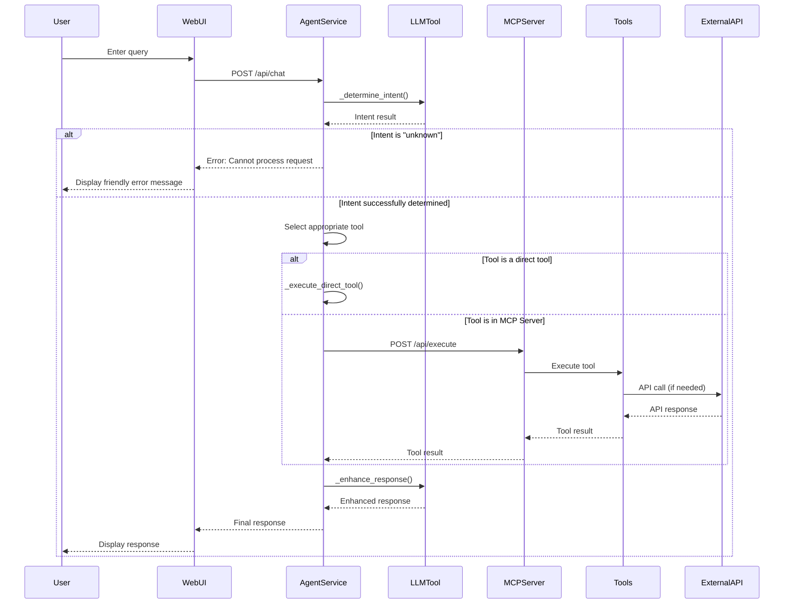

```mermaid
sequenceDiagram
    participant User
    participant WebUI
    participant AgentService
    participant LLMTool
    participant MCPServer
    participant Tools
    participant ExternalAPI

    User->>WebUI: Enter query
    WebUI->>AgentService: POST /api/chat
    
    %% Intent determination phase
    AgentService->>LLMTool: _determine_intent()
    LLMTool-->>AgentService: Intent result
    
    alt Intent is "unknown"
        AgentService-->>WebUI: Error: Cannot process request
        WebUI-->>User: Display friendly error message
    else Intent successfully determined
        %% Tool selection phase
        AgentService->>AgentService: Select appropriate tool
        
        alt Tool is a direct tool
            AgentService->>AgentService: _execute_direct_tool()
        else Tool is in MCP Server
            AgentService->>MCPServer: POST /api/execute
            MCPServer->>Tools: Execute tool
            Tools->>ExternalAPI: API call (if needed)
            ExternalAPI-->>Tools: API response
            Tools-->>MCPServer: Tool result
            MCPServer-->>AgentService: Tool result
        end
        
        %% Response enhancement phase
        AgentService->>LLMTool: _enhance_response()
        LLMTool-->>AgentService: Enhanced response
        
        AgentService-->>WebUI: Final response
        WebUI-->>User: Display response
    end
```