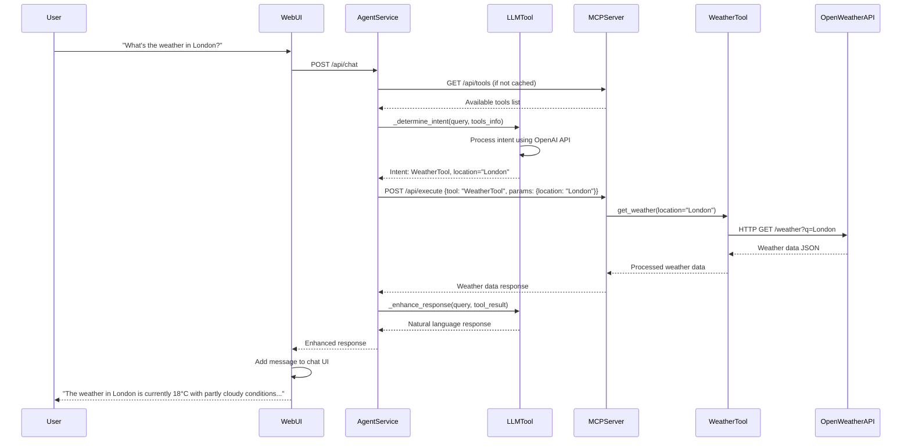

```mermaid
sequenceDiagram
    participant User
    participant WebUI
    participant AgentService
    participant LLMTool
    participant MCPServer
    participant WeatherTool
    participant OpenWeatherAPI

    User->>WebUI: "What's the weather in London?"
    WebUI->>AgentService: POST /api/chat
    
    %% Intent determination phase with details
    AgentService->>MCPServer: GET /api/tools (if not cached)
    MCPServer-->>AgentService: Available tools list
    AgentService->>LLMTool: _determine_intent(query, tools_info)
    
    %% LLM processes the intent
    LLMTool->>LLMTool: Process intent using OpenAI API
    LLMTool-->>AgentService: Intent: WeatherTool, location="London"
    
    %% Agent routes to MCP Server
    AgentService->>MCPServer: POST /api/execute {tool: "WeatherTool", params: {location: "London"}}
    
    %% MCP Server processes the weather request
    MCPServer->>WeatherTool: get_weather(location="London")
    WeatherTool->>OpenWeatherAPI: HTTP GET /weather?q=London
    OpenWeatherAPI-->>WeatherTool: Weather data JSON
    WeatherTool-->>MCPServer: Processed weather data
    MCPServer-->>AgentService: Weather data response
    
    %% Response enhancement
    AgentService->>LLMTool: _enhance_response(query, tool_result)
    LLMTool-->>AgentService: Natural language response
    
    %% Return to user
    AgentService-->>WebUI: Enhanced response
    WebUI->>WebUI: Add message to chat UI
    WebUI-->>User: "The weather in London is currently 18°C with partly cloudy conditions..."
```