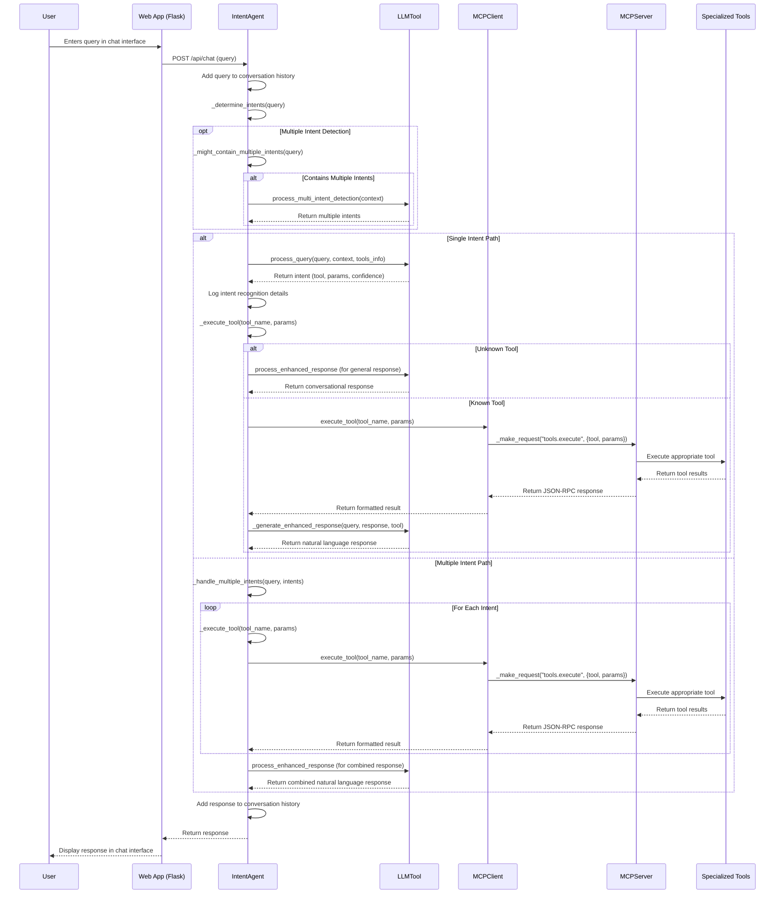

```mermaid
sequenceDiagram
    participant User
    participant WebApp as Web App (Flask)
    participant Agent as IntentAgent
    participant LLM as LLMTool
    participant MCPClient
    participant MCPServer
    participant Tools as Specialized Tools

    User->>WebApp: Enters query in chat interface
    WebApp->>Agent: POST /api/chat (query)
    
    %% Intent Recognition Phase
    Agent->>Agent: Add query to conversation history
    Agent->>Agent: _determine_intents(query)
    opt Multiple Intent Detection
        Agent->>Agent: _might_contain_multiple_intents(query)
        alt Contains Multiple Intents
            Agent->>LLM: process_multi_intent_detection(context)
            LLM-->>Agent: Return multiple intents
        end
    end
    
    alt Single Intent Path
        Agent->>LLM: process_query(query, context, tools_info)
        LLM-->>Agent: Return intent (tool, params, confidence)
        Agent->>Agent: Log intent recognition details
        Agent->>Agent: _execute_tool(tool_name, params)
        
        alt Unknown Tool
            Agent->>LLM: process_enhanced_response (for general response)
            LLM-->>Agent: Return conversational response
        else Known Tool
            Agent->>MCPClient: execute_tool(tool_name, params)
            MCPClient->>MCPServer: _make_request("tools.execute", {tool, params})
            MCPServer->>Tools: Execute appropriate tool
            Tools-->>MCPServer: Return tool results
            MCPServer-->>MCPClient: Return JSON-RPC response
            MCPClient-->>Agent: Return formatted result
            
            %% Response Enhancement Phase
            Agent->>LLM: _generate_enhanced_response(query, response, tool)
            LLM-->>Agent: Return natural language response
        end
    else Multiple Intent Path
        Agent->>Agent: _handle_multiple_intents(query, intents)
        loop For Each Intent
            Agent->>Agent: _execute_tool(tool_name, params)
            Agent->>MCPClient: execute_tool(tool_name, params)
            MCPClient->>MCPServer: _make_request("tools.execute", {tool, params})
            MCPServer->>Tools: Execute appropriate tool
            Tools-->>MCPServer: Return tool results
            MCPServer-->>MCPClient: Return JSON-RPC response
            MCPClient-->>Agent: Return formatted result
        end
        
        %% Combined Response Enhancement
        Agent->>LLM: process_enhanced_response (for combined response)
        LLM-->>Agent: Return combined natural language response
    end
    
    Agent->>Agent: Add response to conversation history
    Agent-->>WebApp: Return response
    WebApp-->>User: Display response in chat interface
```